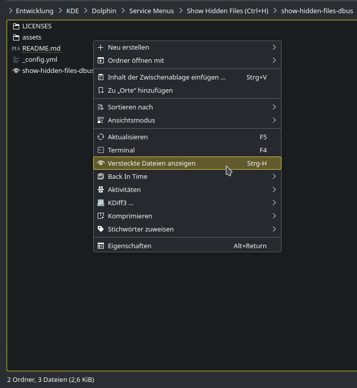

# Hidden Files View

A KDE 5 dolphin context menu extension (aka Service Menu), that let's you
view hidden files as well and toggle between this and default view.

This is for lazy people as me, who want to save the long move with their
pointing device to the "View" menu and "Show Hidden Files" from
within there or do not know about Ctrl+H keyboard shortcut.

After Installation this new action should be available in top level of the
context meneu. (if more than one action applies to directories, it will be
located under "Actions").

This is a clean room implementation based on D-Bus, therefore it lacks any
dependencies beside qdbus(1), that should come basicly always with KDE.

[Homepage](https://c-hartmann.github.io/show-hidden-files-dbus/ "Homepage at GitHub Pages")

